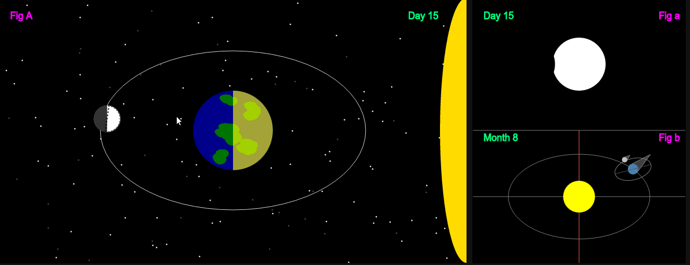

# Moon Phase Visualizer

Moon phase visualizer is a simple demo to understand how the Moon's phases (and eclipses) occur.

**[Moon Phase Visualizer Demo Link](http://palerdot.github.io/moon-phase-visualizer)**

Moon Phase Visualizer is created using [d3.js](https://d3js.org/). There is a short introduction to d3.js using Moon Phase Visualizer.

**[Short d3.js Introduction Link](http://palerdot.github.io/moon-phase-visualizer/d3-moon-viz.html)**

# Feedback & Contributing

Feedback, Improvements and Contributions are greatly appreciated. Checkout the [github issues](https://github.com/palerdot/moon-phase-visualizer/issues) for the current list of issues. 
